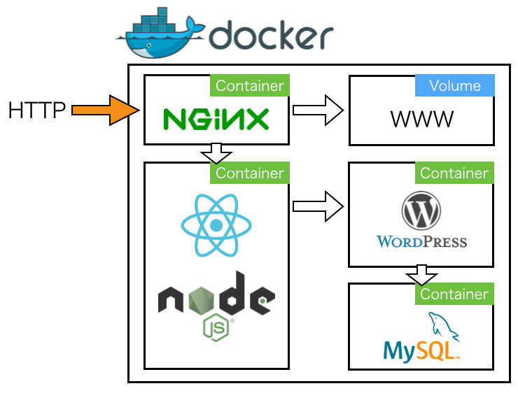

# WordPress REST API + React ServerSide Rendering
WP REST APIでAPIサーバー化したWordPressのデータを、React ServerSide Renderingで表示するサンプルです。これらの構成をDocker Composeで実現しています。

詳細はこちらの記事を
[React SSR＋WordPress REST APIをDocker Composeで試す](React SSR＋WordPress REST APIをDocker Composeで試す)

## Architecture

## Stack
* Docker
* Docker Compose
* React.js
* node.js
* WebPack
* WordPress(with WP REST API)
* MySQL
